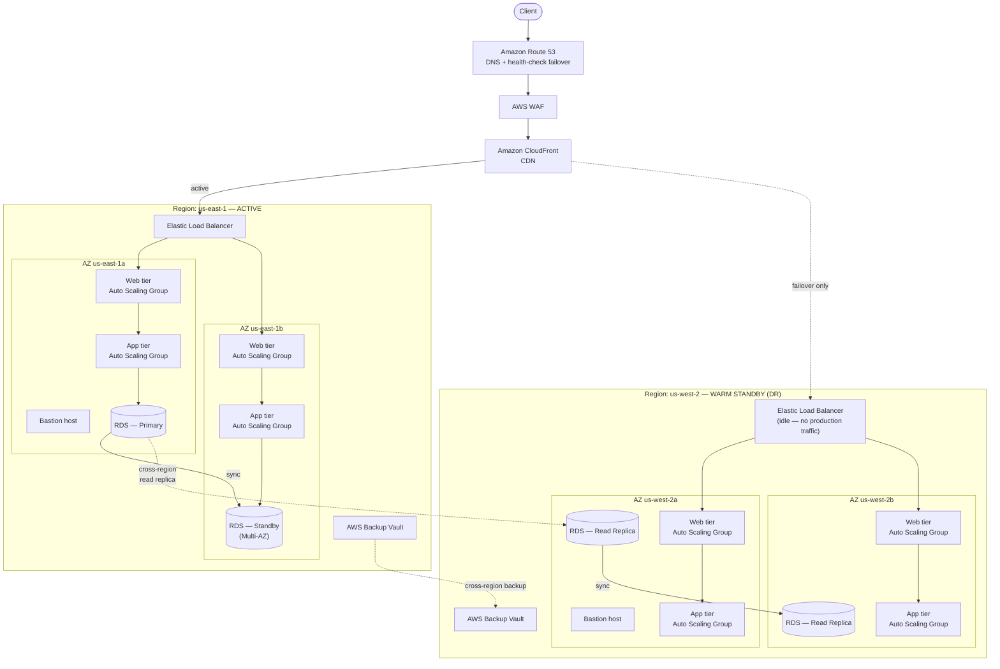

# Full Automation Setup — From Zero

One workflow, one trigger: **push to `main`** (or click "Run workflow" in
the Actions tab). From there it runs, in order:

1. **Terraform** creates/updates the VPC, a private app server, a bastion
   host, an Application Load Balancer, and RDS — DB password and the SSH
   key pair are both generated automatically and never leave AWS
2. **Build** compiles the WAR with Maven
3. **Docker** builds & pushes a versioned image to GitHub Container Registry
4. **Deploy** hops through the bastion over SSH to reach the private app
   server, ships the WAR, restarts Tomcat, health-checks it via the load
   balancer, and rolls back automatically if the health check fails

## Architecture

The app server has **no public IP at all**. There are exactly two ways
into this setup from the outside:

- **The website itself**, via the Application Load Balancer (public
  subnet) → forwards HTTP to the app server (private subnet)
- **SSH**, via the bastion host (public subnet) → the only machine that
  can reach the app server on port 22; the app server's security group
  refuses SSH from anywhere else, including the internet directly

```
Internet
   │
   ├──HTTP──▶ ALB (public subnet) ──▶ App server (private subnet, port 80)
   │
   └──SSH───▶ Bastion (public subnet) ──▶ App server (private subnet, port 22)

App server ──MySQL──▶ RDS (private subnet, no public access ever)
```

Nothing is typed into a `.env` file or committed to the repo. The SSH key
pair is generated by Terraform (`tls_private_key`) and stored only in AWS
Systems Manager Parameter Store, encrypted — the deploy job fetches it at
deploy time using the same AWS credentials it already has.

The workflow file is `.github/workflows/full-deploy.yml`.

---

## Step 0 — One-time manual setup

Only one thing can't be automated away: AWS needs to trust GitHub Actions
before anything can be created. Create an IAM user (e.g.
`github-actions-deployer`) with programmatic access, attach
`AdministratorAccess` to get started (tighten later), and generate an
access key.

---

## Step 1 — Add GitHub Secrets

**Settings → Secrets and variables → Actions → New repository secret:**

| Secret | Value |
|---|---|
| `AWS_ACCESS_KEY_ID` | from the IAM user above |
| `AWS_SECRET_ACCESS_KEY` | from the IAM user above |

That's the whole list. Optionally, add a repo **variable** (not secret,
under the same Actions settings page, "Variables" tab):

| Variable | Value |
|---|---|
| `SSH_INGRESS_CIDR` | your IP in CIDR form, e.g. `203.0.113.10/32`. If you skip this, the bastion's SSH port defaults to open to the internet (`0.0.0.0/0`), which still requires the private key to actually log in, but is worth tightening. |

---

## Step 2 — Push

```bash
git add .
git commit -m "Bastion-based private deployment"
git push
```

Go to the **Actions** tab → `Full Deploy - Infra + Build + Deploy`. First
run takes ~5–8 minutes (VPC/RDS/ALB provisioning + server bootstrap).
When it's green, the app is live at the ALB's DNS name — check the
`Health check via the load balancer` step's log for the exact URL, or run
`terraform output alb_dns_name` yourself.

---

## Manual access (debugging)

SSH to the app server yourself by hopping through the bastion:
```bash
aws ssm get-parameter --name "/skillexchange/deploy-ssh-key" --with-decryption \
  --query "Parameter.Value" --output text > deploy_key.pem
chmod 600 deploy_key.pem

BASTION_IP=$(cd terraform && terraform output -raw bastion_public_ip)
APP_IP=$(cd terraform && terraform output -raw app_private_ip)

ssh -i deploy_key.pem -o ProxyCommand="ssh -i deploy_key.pem -W %h:%p ec2-user@$BASTION_IP" ec2-user@$APP_IP
```

## Rollback

Every deploy leaves a timestamped backup on the server (`/opt/tomcat10/webapps/ROOT.war.bak-*`),
and the pipeline also rolls back automatically if a deploy's health check fails.

---

## Troubleshooting

- **Deploy job stuck at "Wait for bastion and app instance to be reachable
  over SSH"** — first boot takes a few minutes; if it never clears after
  ~5 minutes, check the EC2 console for the instance's state, and confirm
  the bastion and app security groups reference each other correctly
  (`terraform plan` locally will show you the actual rules).
- **Deploy script fails on the app instance** — the workflow prints the
  remote command's output directly in the Actions log.
- **Docker push fails with permission error** — repo **Settings → Actions
  → General → Workflow permissions** → set to "Read and write permissions",
  and confirm the `ghcr.io` package (Settings → Packages on your profile)
  has this repo added under "Manage Actions access" with Write role.

See `terraform/README.md` for infra-specific details.

---

## Reference: how this would scale to a production, multi-region setup

**This section describes a target architecture, not what's currently
deployed.** The project as built runs the single-region setup documented
above — one app server, one bastion, one ALB, one RDS instance. What
follows is the standard AWS pattern this project would grow into for a
real production workload with high-availability and disaster-recovery
requirements, useful as a "how would you scale this" answer but not a
claim about the running infrastructure.



### What changes at each step, and why

| Current (this project) | Production evolution | Why it's added |
|---|---|---|
| Single EC2 app server | Auto Scaling Group across 2+ AZs, both web tier (Nginx) and app tier (Tomcat) split into their own ASGs | Survives an instance or AZ failure; scales with real traffic instead of a fixed-size box |
| Single ALB, single region | ALB per region + Route 53 with health-check-based failover | Removes the region itself as a single point of failure |
| No CDN | CloudFront in front of the ALB | Caches static assets at the edge, cuts latency globally, absorbs traffic spikes |
| No WAF | AWS WAF in front of CloudFront | Blocks common web attacks (SQLi, XSS, bot traffic) before they reach the app |
| Single RDS instance | Multi-AZ RDS (synchronous standby) + cross-region read replica | Multi-AZ gives automatic failover within the region; the cross-region replica is the seed for the DR region if the primary region goes down entirely |
| No backup automation | AWS Backup with a cross-region backup vault | Point-in-time recovery that survives losing an entire region, not just an instance |
| One bastion | One bastion per region | DR region needs its own operational access path too |

**What stays the same:** the core security posture — app servers with no
public IP, database never internet-reachable, SSH only through a bastion,
HTTP only through a load balancer — applies at every scale. This project
already implements that pattern; the production version just repeats it
across more AZs and a second region, and adds the edge/WAF/CDN layer in
front of it.
